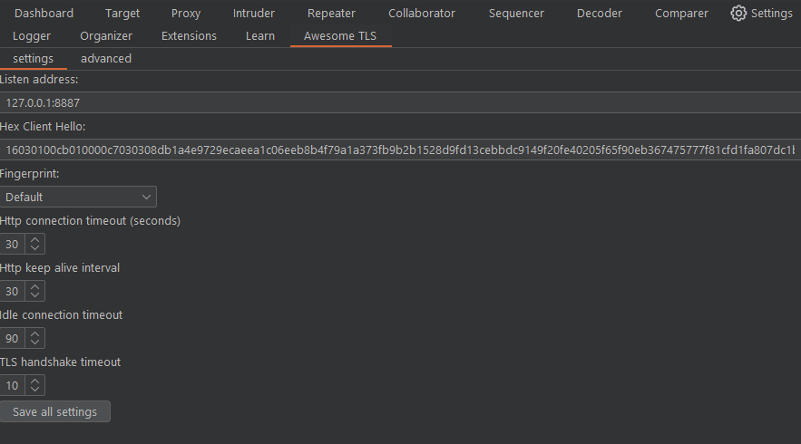
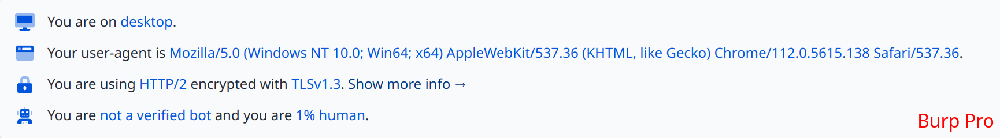
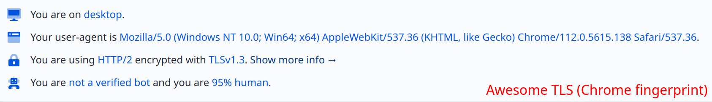
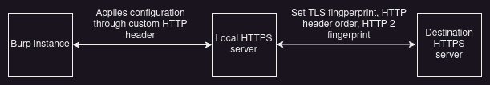
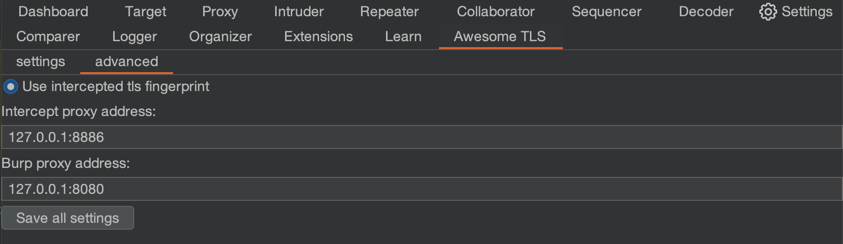
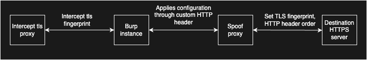

# Awesome TLS
This extension hijacks Burp's HTTP and TLS stack, allowing you to spoof any browser TLS fingerprint ([JA3](https://github.com/salesforce/ja3)). 
It boosts the power of Burp Suite while reducing the likelihood of fingerprinting by various WAFs like CloudFlare, PerimeterX, Akamai, DataDome, etc.

It does this without resorting to hacks, reflection or forked Burp Suite Community code. All code in this repository only leverages Burp's official Extender API.

## Showcase
[CloudFlare bot score](https://cloudflare.manfredi.io/en/tools/connection):

This is just one example. If you tested with another dedicated bot detection site, let me know your results! 

## How it works
Unfortunately Burp's Extender API is very limited for more advanced use cases like this, so I had to play around with it to make this work. 

Once a request comes in, the extension intercepts it and forwards it to a local HTTPS server that started in the background (once the extension loaded).
This server works like a proxy; it forwards the request to the destination, while persisting the original header order and applying a customizable TLS configuration.
Then, the local server forwards the response back to Burp. The response header order is also preserved.

Configuration settings and other necessary information like the destination server address and protocol are sent to the local server per request by a magic header.
This magic header is stripped from the request before it's forwarded to the destination server, of course.

> :information_source: Another option would've been to code an upstream proxy server and connect burp to it, but I personally needed an extension for customization and portability. 

## Installation
1. Download the jar file for your operating system from [releases](https://github.com/sleeyax/burp-awesome-tls/releases). You can also download a fat jar, which works on all platforms supported by Awesome TLS. This means it's also portable and could be loaded from a USB for cross-platform access.
2. Open burp (pro or community), go to Extender > Extensions and click on 'Add'. Then, select `Java` as the extension type and browse to the jar file you just downloaded. Click 'Next' at the bottom, and it should load the extension without any errors.
3. Check your new 'Awesome TLS' tab in Burp for configuration settings and start hacking!

## Configuration
This extension is 'plug and play' and should speak for itself. You can hover with your mouse over each field in the 'Awesome TLS' tab for more information about each field.

  
Advanced usage

  
In the 'advanced' tab, you can enable an additional proxy listener that will automatically apply the current fingerprint from the request:

When enabled, the diagram changes to this:

## Manual build Instructions
This extension was developed with JetBrains IntelliJ (and GoLand) IDE. 
The build instructions below assume you're using the same tools to build.
See [workflows](.github/workflows) for the target programming language versions.

1. Compile the go package within `./src-go/`. Run `cd ./src-go/server && go build -o ../../src/main/resources/{OS}-{ARCH}/server.{EXT} -buildmode=c-shared ./cmd/main.go`, replacing `{OS}-{ARCH}` with your OS and CPU architecture and `{EXT}` with your platform's preferred extension for dynamic C libraries. For example: `linux-x86-64/server.so`. See the [JNA docs](https://github.com/java-native-access/jna/blob/master/www/GettingStarted.md) for more info about supported platforms.
2. Compile the GUI form `SettingsTab.form` into Java code via `Build > Build project`.
3. Build the jar with Gradle: `gradle buildJar`.

You should now have one jar file (usually located at `./build/libs`) that works with Burp on your operating system.

## Credits
Special thanks to the maintainers of the following repositories:
- [refraction-networking/utls](https://github.com/refraction-networking/utls)
- [ooni/oohttp](https://github.com/ooni/oohttp)

And the creators of the following websites:
- https://tlsfingerprint.io/
- https://kawayiyi.com/tls
- https://tls.peet.ws/
- https://cloudflare.manfredi.io/en/tools/connection
- https://scrapfly.io/web-scraping-tools/http2-fingerprint

## License
[GPL V3](./LICENSE)
